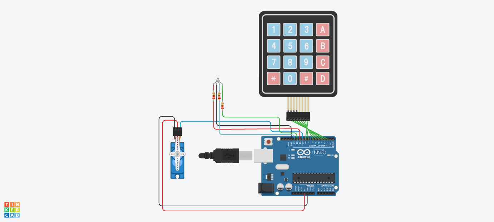

# Electronic Door Lock with RGB Indicator (Tinkercad)

This project is a password-controlled electronic door lock simulated in Tinkercad. An Arduino Uno reads a PIN entered through a 4x4 keypad. A micro servo represents the physical locking mechanism.

An RGB LED provides status feedback. Blue means the system is locked and waiting for a PIN. Green means access is granted. Red means access is denied. The project demonstrates the basic operating principle behind keypad-controlled access systems used in doors, lockers, cabinets, and other security systems.

🔗 **Tinkercad simulation:** [open the circuit](https://www.tinkercad.com/things/943wKnsWRWk-electronic-door-with-rgb-light-indicator)

---

## How it works

The Arduino continuously scans the 4x4 keypad for key presses. Number keys are added to the entered PIN. The `*` key clears the current entry, while `#` submits the PIN for verification.

The demonstration PIN is `1234`.

When the entered PIN matches `1234`, the RGB LED changes from blue to green and the servo rotates from 0° to 90°. This represents the door unlocking. After 5 seconds, the servo returns to 0° and the RGB LED becomes blue again.

If the PIN is incorrect, the RGB LED changes from blue to red for 2 seconds. The servo does not move. The system then returns to the locked state.

| State | RGB indicator | Servo position | Meaning |
|---|---|---:|---|
| Waiting | Blue | 0° | Door locked and waiting for PIN |
| Correct PIN | Green | 90° | Access granted |
| Incorrect PIN | Red | 0° | Access denied |
| Automatic relock | Blue | 0° | Door locked again |

The keypad is a matrix keypad. Its 16 buttons are arranged as four rows and four columns. This allows the Arduino to identify 16 different buttons using only eight input/output pins.

The RGB LED is a common-cathode type. Its common cathode is connected to ground. The Arduino controls the red, green, and blue channels separately.

---

## Design files

| File | Description |
|---|---|
| [Schematic (PDF)](Electronic_Door_Lock.pdf) | Schematic view of the completed circuit |
| [PCB board file (.brd)](Electronic_Door_Lock.brd) | Board design file associated with the project |
| [`electronic_door_lock.ino`](electronic_door_lock.ino) | Arduino C++ program for the door lock |

---

## Parts

| Part (Tinkercad name) | Qty | Settings |
|---|---:|---|
| Arduino Uno R3 | 1 | 5 V logic |
| Keypad 4x4 | 1 | 4 rows, 4 columns |
| Micro Servo | 1 | 0° locked, 90° unlocked |
| RGB LED | 1 | Common cathode |
| Resistor | 3 | 220 Ω, one for each RGB channel |
| Connecting wires | As required | Used for signal, 5 V and GND connections |

For real hardware, an Arduino Uno or another 5 V compatible microcontroller could be used. A small hobby servo such as an SG90 can demonstrate the locking motion. A real door lock would normally use a suitable solenoid, geared motor, or dedicated electronic locking mechanism with a proper driver circuit and separate power supply.

Each RGB LED channel should have its own current-limiting resistor. A value around 220 Ω is suitable for this demonstration.

---

## Wiring

### 4x4 keypad

| Keypad pin | Arduino pin | Purpose |
|---|---|---|
| Row 1 | D2 | Keypad row |
| Row 2 | D3 | Keypad row |
| Row 3 | D4 | Keypad row |
| Row 4 | D5 | Keypad row |
| Column 1 | D6 | Keypad column |
| Column 2 | D7 | Keypad column |
| Column 3 | D8 | Keypad column |
| Column 4 | D9 | Keypad column |

### Micro servo

| Servo connection | Arduino connection |
|---|---|
| Signal | D10 |
| Power | 5V |
| Ground | GND |

### Common-cathode RGB LED

| RGB LED connection | Arduino connection |
|---|---|
| Red | D11 through 220 Ω resistor |
| Green | D12 through 220 Ω resistor |
| Blue | D13 through 220 Ω resistor |
| Common cathode | GND |

⚠️ Do not connect the RGB LED channels directly to the Arduino outputs without current-limiting resistors.

⚠️ The common pin of the RGB LED used in this project is the cathode and must be connected to GND. A common-anode RGB LED requires different wiring and inverted control logic.

⚠️ A real high-current door lock or large servo should not be powered directly from an Arduino output pin. A suitable driver and power supply should be used.

---

## Test procedure

1. Start the Tinkercad simulation. The RGB LED should turn blue and the servo should remain at 0°.

2. Enter `1234` on the keypad. The LED should remain blue while the PIN is being entered.

3. Press `#` to submit the PIN. The RGB LED should turn green and the servo should rotate to 90°.

4. Wait 5 seconds. The servo should return to 0° and the RGB LED should return to blue.

5. Enter an incorrect PIN such as `1111` and press `#`. The RGB LED should turn red and the servo should remain at 0°.

6. Wait 2 seconds after an incorrect PIN. The RGB LED should return to blue.

7. Begin entering a PIN and press `*`. The stored input should be cleared so a new PIN can be entered.

8. Open the Serial Monitor. Key events and access results should be printed for debugging.

---

## Results and observations

- The 4x4 keypad successfully provided PIN input to the Arduino.
- The demonstration PIN `1234` was correctly recognised.
- With the correct PIN, the RGB indicator changed from blue to green.
- The micro servo rotated from 0° to 90° when access was granted.
- The servo remained in the unlocked position for approximately 5 seconds before returning to 0°.
- After relocking, the RGB indicator returned to blue.
- With an incorrect PIN, the RGB indicator changed from blue to red.
- The servo remained in the locked position when an incorrect PIN was entered.
- The RGB LED successfully replaced the originally planned LCD as a simpler status indicator.
- No electrical voltage or current measurements were recorded for the completed circuit.
- The servo movement used by the program is:

  $\Delta\theta = 90^\circ - 0^\circ = 90^\circ$

- The programmed unlocked time is:

  $t_{unlock} = 5000\text{ ms} = 5\text{ s}$

- The programmed access-denied indication time is:

  $t_{denied} = 2000\text{ ms} = 2\text{ s}$

---

## Known issues and limitations

- A 16x2 I2C LCD was originally planned to display messages such as `Access Granted`, `Access Denied`, and masked PIN input.
- The I2C LCD did not operate reliably in the Tinkercad implementation. It remained blank during testing despite attempts to correct its wiring and I2C configuration.
- The LCD was therefore removed and replaced with a simpler common-cathode RGB LED.
- The RGB LED can communicate the basic lock state but cannot display detailed messages or the number of entered digits.
- The PIN `1234` is hard-coded in the Arduino program. This is acceptable for a demonstration but is not secure for a real access-control system.
- The project does not permanently store a changed PIN.
- There is no lockout mechanism after repeated incorrect attempts.
- The micro servo represents a door lock. The simulation does not test the mechanical forces required to operate a real door lock.
- The circuit has not been verified as a physical door security system.
- No electrical current or voltage measurements were recorded for the final design.

---

## Things I learned

- A microcontroller can read a matrix keypad by scanning its rows and columns.
- A 4x4 matrix keypad provides 16 buttons while requiring eight microcontroller pins instead of one separate pin for every button.
- Software can compare a sequence of keypad inputs with a stored PIN to implement basic access control.
- A servo motor can convert an Arduino control signal into mechanical movement.
- An RGB LED can communicate several system states using one physical indicator.
- A common-cathode RGB LED connects all three LED cathodes to a common ground.
- Each LED channel requires a current-limiting resistor.
- A project can be simplified when a component creates unnecessary complexity. Replacing the unreliable LCD with an RGB indicator allowed the main door-lock functionality to remain operational.
- Real embedded systems often use I/O expanders, serial communication buses, or microcontrollers with more pins when there are not enough general-purpose input/output pins.
- Real electronic locks require additional consideration for power supplies, mechanical strength, fail-safe behaviour, and security.

---

## Future improvements

- Retry the 16x2 I2C LCD integration and determine why it failed in the original simulation.
- Display masked characters such as `****` while the PIN is being entered.
- Display `Access Granted` and `Access Denied` messages on the LCD.
- Allow the user to change the PIN using the keypad.
- Store the PIN in EEPROM so it remains saved after power is removed.
- Add a maximum number of incorrect attempts followed by a temporary lockout.
- Add a buzzer for audible feedback.
- Add a door-position sensor to detect whether the door is actually open or closed.
- Use an I/O expander if additional peripherals require more Arduino pins.
- Build a physical prototype and measure its supply voltage and current consumption.
- Replace the demonstration servo with a suitable locking actuator and driver circuit for a real prototype.

---

## License

MIT
